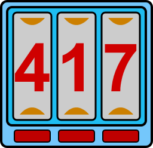

# KaosCombinatorics

KaosCombinatorics is a .NET library that provides classes
for generating combinations, k-combinations, multicombinations, k-multicombinations, permutations, k-permutations, and products
that are ordered and ranked.
These sequences of integers may be used to permute (rearrange) other lists of objects.
Features ranking, unranking, backtracking, plain changes, and more.

Primary types provided are:

* `Combination` - an ascending sequence of distinct picks from a supplied range.
* `Multicombination` - an ascending sequence of repeating picks from a supplied range.
* `Permutation` - a specific arrangement of distinct picks from a supplied range.
* `Product` - a join of values from a supplied array of ranges.

Two key features this library provides are **unranking** and **ranking** for every combinatoric.
Unranking is the ability to quickly retrieve any row in the combinatoric's lexicographically ordered table by setting its Rank property,
or by supplying the rank to a constructor.
Ranking is where the elements of a combinatoric are supplied as an array of integers to a constructor.
The Rank property will then contain its position in the ordered table.

This library is built as a .NET Standard project multitargeted to:

* .NET Standard 1.0.
* .NET Framework 4.0.
* .NET Framework 3.5.

### Library installation

Beginning with version 6, NuGet package hosting is provided GitHub Package Registry.
See GitHub for NuGet configuration documentation on getting packages from:

https://github.com/kaosborn/KaosCombinatorics/packages/

#### To install using Package Manager:

**`Install-Package Kaos.Combinatorics -Version 6.0.0.0`**

#### To install using the .NET CLI:

**`dotnet add package Kaos.Combinatorics --version 6.0.0.0`**

#### To install from local source using the Visual Studio gallery

1. In Solution Explorer, Click *Manage NuGet Packages* for your project.
2. Set *Package source* to your local nuget repository.
3. Click *Browse* and input **Kaos.Combinatorics**.
4. The package should appear. Click *Install*.

As a multitargeted package, the appropriate binary will be installed for your project.

Note that (at the time of this writing) if a *Package source* of *nuget.org* is used,
the previous version 5 of this library will be installed instead of the current version 6.

#### Install using a direct reference to a `.dll` binary:

1. Download the `.nuget` package from:

https://github.com/kaosborn/KaosCombinatorics/packages/

2. As archives, individual binaries may be extracted from the `.nuget` package for specific platforms.
This may require changing the file extension from `.nuget` to `.zip` to access the contents.
A project may then reference the extracted platform-specific `.dll` directly.

#### Build from source

This project may be built from source.
There are no external dependencies.
Starting with v6, the target .NET binary is built as a strong-named assembly to support GAC installation.
To distribute your build of this library,
you must disable compiling with a strong name (or supply your own key pair).
Do this by modifying the *Combinatorics* project properties and unchecking *Sign the assembly* in the *Singing* tab.

### Documentation

Installing the NuGet package will provide IntelliSense and object browser documentation via its `.xml` file.
For complete online documentation:

* https://kaosborn.github.io/help/KaosCombinatorics/

Identical documentation is available as a Microsoft Help v1 file below.
This downloaded `.chm` file may require unblocking thru its file properties dialog.

* https://github.com/kaosborn/KaosCombinatorics/releases/

Finally, examples are repeated in the repository wiki:

* https://github.com/kaosborn/KaosCombinatorics/wiki/

### Repository top-level folders

This repository is a single Visual Studio solution with additional files in the root.

* `Bench` - Console programs that exercise this library.

* `Combinatorics` - The target NuGet package.
Building the Release configuration of the project contained in this folder
will produce a `.nuget` file and documentation for distribution.
This library is multitargeted to .NET Standard 1.0, .NET 4.0 and .NET 3.5.

* `Combinatorics450` - A .NET 4.5 build of the class library for test & development.

* `Examples` - Console programs for documentation.

* `Help` - [Sandcastle Help File Builder](https://github.com/EWSoftware/SHFB)
project that produces documentation from embedded XML comments.
Output is a Microsoft Help v1 file with a `.chm` extension and (optionally) a static web site.

* `Images` - SVG files with renderings.

* `Install` - Builds a GAC installer.

* `Source` - All source code in a shared project.

* `Test450` - MSTest unit tests and limited stress tests.
Line and branch coverage is 100%.

### Build requirements

 All links in this section are to free software.

* https://github.com/kaosborn/KaosCombinatorics/ - Complete source is hosted at GitHub.

* https://www.visualstudio.com/downloads/ - Building the solution requires Visual Studio 2017 Community Edition or greater.

* https://marketplace.visualstudio.com/items?itemName=visualstudioclient.MicrosoftVisualStudio2017InstallerProjects - Building the `.msi` GAC installer requires the Microsoft Visual Studio Installer Projects extension.

* https://github.com/EWSoftware/SHFB/releases/ - Building `.chm` or web documentation requires Sandcastle Help File Builder.
